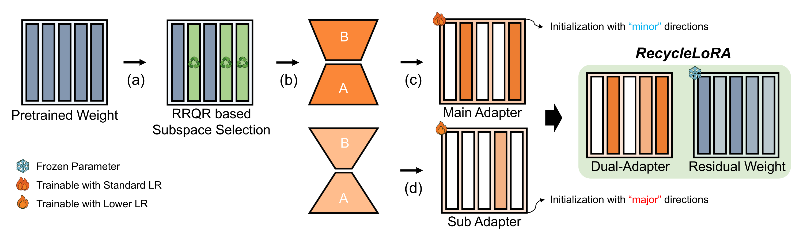

# RecycleLoRA: Rank-Revealing QR-Based Dual-LoRA Subspace Adaptation for Domain Generalized Semantic Segmentation

Official implementation of **RecycleLoRA**.

> Chanseul Cho, Seokju Yun, Jaesung Jun, Seungjae Moon, Youngmin Ro.
> *Machine Intelligence Laboratory, University of Seoul.*
> CVPR 2026 Findings | [arXiv](https://arxiv.org/abs/2603.28142)



RecycleLoRA adapts a Vision Foundation Model (DINOv2) for Domain Generalized
Semantic Segmentation (DGSS) with a **dual low-rank adapter** whose initialization
is derived from a **Rank-Revealing QR (RRQR)** decomposition of each pre-trained
linear layer:

* **Main adapter** — initialized from the *minor* (least important) RRQR
  directions (rank 32).
* **Sub adapter** — initialized from the *major* (most important) RRQR
  directions (rank 4 for synthetic-to-real, 2 for real-to-real).

The build is based on
[Rein](https://github.com/w1oves/Rein) and [SoMA](https://github.com/ysj9909/SoMA).

## Installation

```bash
conda create -n recyclelora python=3.10 -y
conda activate recyclelora

# PyTorch (match your CUDA), e.g.:
pip install torch torchvision

pip install -U openmim
mim install mmengine "mmcv>=2.0.0" "mmsegmentation>=1.0.0" "mmdet>=3.0.0"
pip install -r requirements.txt
# optional, for faster attention:
pip install xformers
```

## Data preparation

Place datasets under `data/` (Cityscapes-style layout). GTAV, Cityscapes,
BDD100K, Mapillary, Synthia and UrbanSyn are prepared as in Rein/SoMA;
converters are in `tools/convert_datasets/`, e.g.:

```bash
python tools/convert_datasets/gta.py data/gta          # -> *_labelTrainIds.png
python tools/convert_datasets/cityscapes.py data/cityscapes
```

```
data/
├── gta/{images,labels}
├── cityscapes/{leftImg8bit,gtFine}
├── bdd100k/...
├── mapillary/...
├── synthia/...
└── urbansyn/...
```

## Pretrained backbone

Prepare `checkpoints/dinov2_converted.pth` — see [`checkpoints/README.md`](checkpoints/README.md).

## Training

```bash
# single GPU
python tools/train.py configs/dinov2/g2cbm_recyclelora_dinov2_mask2former.py

# multi-GPU (e.g. 4)
bash tools/dist_train.sh configs/dinov2/g2cbm_recyclelora_dinov2_mask2former.py 4
```

Configs:

| Config | Setting |
| --- | --- |
| `g2cbm_recyclelora_dinov2_mask2former.py` | GTAV → Cityscapes/BDD/Mapillary (syn→real) |
| `gs2cbm_recyclelora_dinov2_mask2former.py` | GTAV+Synthia → … |
| `gsu2cbm_recyclelora_dinov2_mask2former.py` | GTAV+Synthia+UrbanSyn → … |
| `c2bm_recyclelora_dinov2_mask2former.py` | Cityscapes → BDD/Mapillary (real→real) |

Checkpoints store the full model, so `tools/test.py <config> <checkpoint>`
evaluates them directly.

## Evaluation

```bash
python tools/test.py <config> <checkpoint.pth>
```

## Acknowledgements

This codebase is built on [Rein](https://github.com/w1oves/Rein) (CVPR 2024) and
[SoMA](https://github.com/ysj9909/SoMA) (CVPR 2025). We thank the authors for
releasing their code.

## Contact

For questions about the paper or code, please email
[chanseul2001@gmail.com](mailto:chanseul2001@gmail.com).

## Citation

```bibtex
@inproceedings{cho2026recyclelora,
  title={RecycleLoRA: Rank-Revealing QR-Based Dual-LoRA Subspace Adaptation for Domain Generalized Semantic Segmentation},
  author={Cho, Chanseul and Yun, Seokju and Jun, Jaesung and Moon, Seungjae and Ro, Youngmin},
  booktitle={Proceedings of the IEEE/CVF Conference on Computer Vision and Pattern Recognition},
  pages={7503--7513},
  year={2026}
}
```
